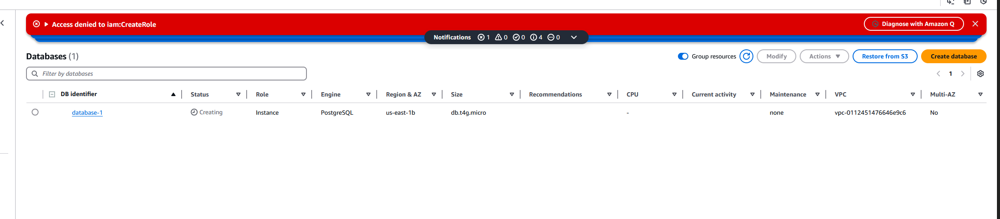
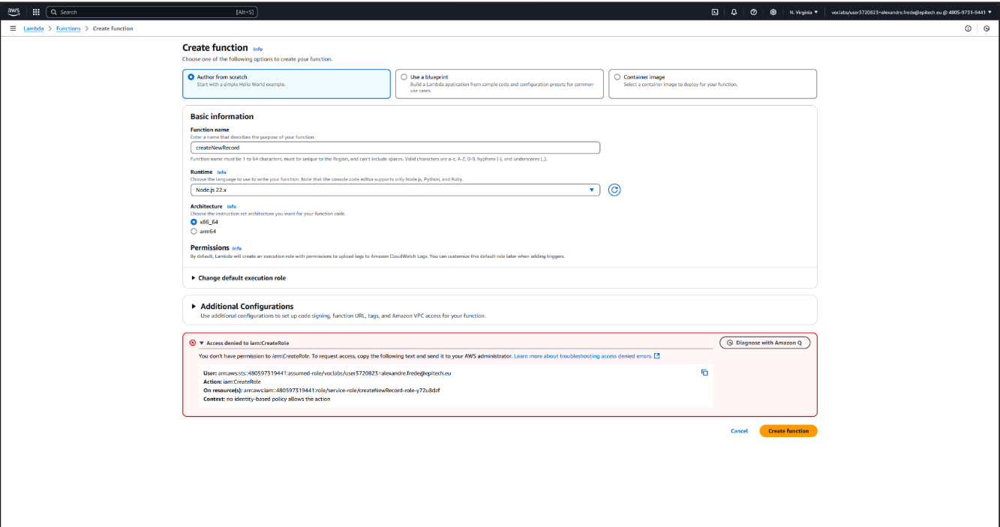

# AWS workshop 2

During my attempt to use AWS services for workshop 2, I encountered a permissions-related issue that prevented me from proceeding.

### Screenshots:
Below are screenshots illustrating the issue:

#### Screenshot 1: RDS


#### Screenshot 2: Lambda


## How to run app

```bash
pnpm install
pnpm dev
```
